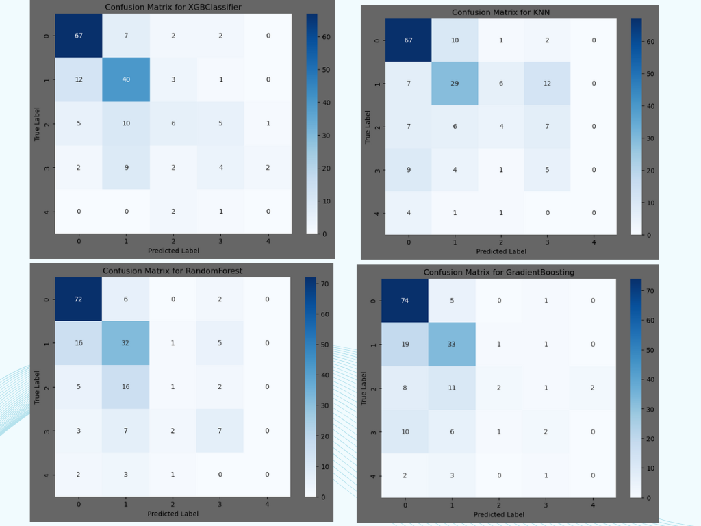
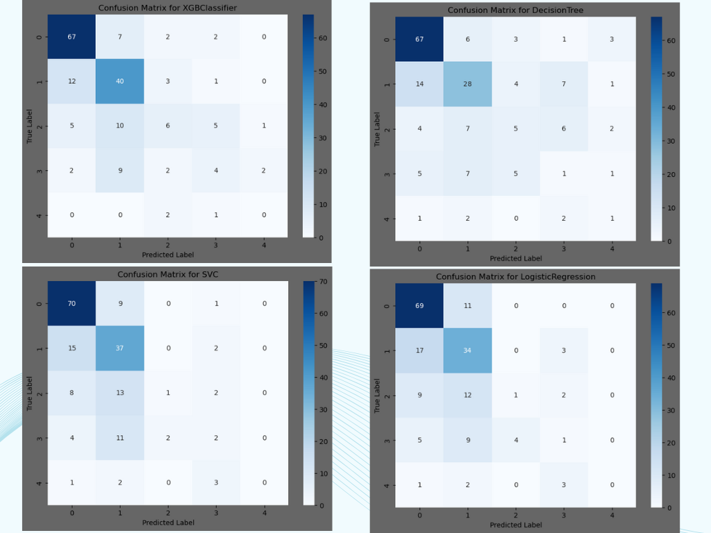
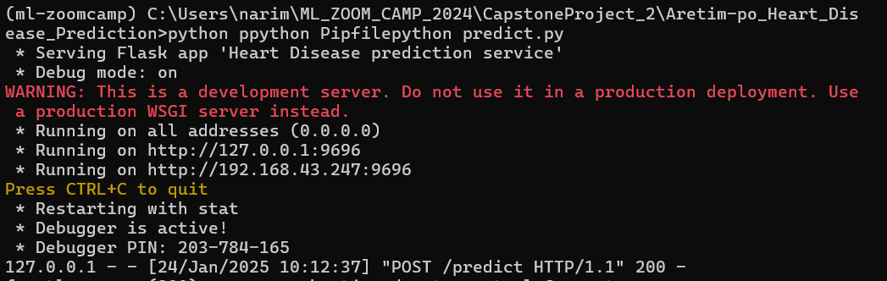
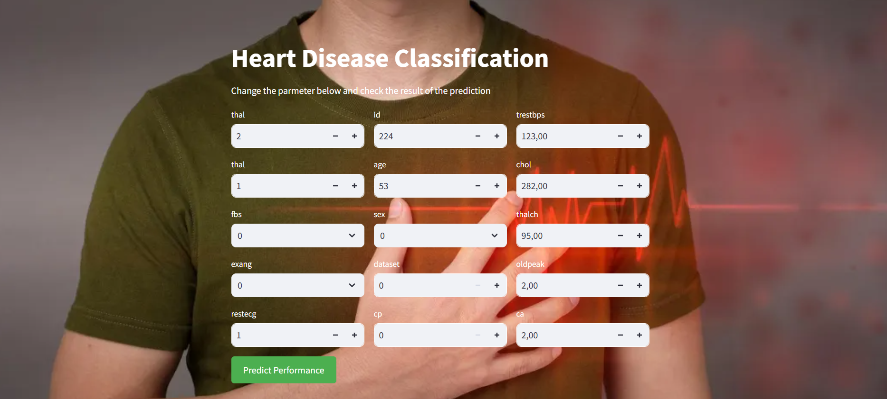

# Heart Disease Risk Assessment with Machine Learning 

Welcome to the **Aretim-po Prediction or Heart Disease** project! This repository designed a project to predict heart disease risk comparing some Machine Learning models, featuring data preprocessing, model training, evaluation, and deployment-ready insights.

## Table of Contents

1. [Overview](#overview)
2. [Dataset](#dataset)
3. [Setup Instructions](#setup-instructions)
4. [Model performance](#model)
5. [Deploiment](#deploiment)

## Overview

The porpuse of this project is a machine learning focused on assessing the risk of heart disease! 
This repository encompasses a comprehensive workflow to compare three Machine Learning models.
It includes data preprocessing, model training, performance evaluation, and deployment-ready insights to aid in predicting heart disease risk efficiently and accurately.

## Problem Statement
Heart disease is one of the leading causes of death worldwide, and early risk assessment is crucial for timely intervention and prevention. However, identifying individuals at risk often relies on manual evaluations and traditional diagnostic methods, which can be time-consuming and inconsistent. The lack of accessible, efficient, and accurate risk prediction tools hampers the ability of healthcare professionals to prioritize and personalize patient care.

## Project Objectives
1. **Develop a Machine Learning Model:** Create a system capable of accurately predicting the risk of heart disease using structured health data.
2. **Compare Model Performance:** Evaluate and compare the efficiency and accuracy of three Machine Learning models to identify the most suitable one for deployment.
3. **Optimize Data Handling:** Implement robust data preprocessing techniques to ensure high-quality inputs for model training.
4. **Generate Actionable Insights:** Provide clear, deployment-ready insights to support healthcare professionals in risk assessment and decision-making.
5. **Improve Healthcare Accessibility:** Enable faster, scalable, and reliable heart disease risk predictions for diverse populations.
6. **Deploy the Model:** 
   - Initially deploy the model locally using Flask in a Docker container.  
   - Deployment in the cloud [Posit Connect Cloud](https://connect.posit.cloud/)to ensure scalability and accessibility for a wider audience.
   [To Test The model,  click here , Simulation in Streamlit](https://0194c674-5312-fe42-ed55-d0b2843b5ea6.share.connect.posit.cloud/)

## Purpose
The purpose of this project is to harness the power of Machine Learning to assess the risk of heart disease. This repository encompasses a comprehensive workflow, including:
- Data preprocessing
- Model training
- Performance evaluation
- Deployment-ready insights

These steps aim to aid in predicting heart disease risk efficiently and accurately, contributing to improved healthcare outcomes.

## Dataset

The repository includes data derived from [UCI Heart Disease Data](https://www.kaggle.com/datasets/redwankarimsony/heart-disease-data) 

Dataset Details:
This dataset is multivariate, containing multiple statistical variables, and is widely used in machine learning research for heart disease prediction and analysis. It is derived from the Cleveland database and includes **14 key attributes** commonly used in published studies.

## Attributes
The dataset focuses on the following features:

- **Demographics**:
  - Age
  - Sex
- **Clinical Measurements**:
  - Chest pain type
  - Resting blood pressure
  - Serum cholesterol
  - Fasting blood sugar
  - Resting electrocardiographic results
- **Exercise Data**:
  - Maximum heart rate achieved
  - Exercise-induced angina
  - ST depression induced by exercise relative to rest ("oldpeak")
  - Slope of the ST segment during peak exercise
- **Other**:
  - Number of major vessels
  - Thalassemia

## Target Column: `num`
- The `num` column represents the predicted attribute for heart disease.
- Unique values: `[0, 1, 2, 3, 4]`, indicating 5 types of heart diseases.
   - 0 = no heart disease.
   - 1 = Mild Heart Disease types.
   - 2 = Moderate Heart Disease type.
   - 3 = Severe Heart Disease type.
   - 4 = Critical Heart Disease type.

## Notes
- The full database contains 76 attributes, but only these 14 are  used .
- [python 3.8.10](https://www.python.org/downloads/release/python-3810/) required for the project

## Files structure in Repository:
Date/
heart_disease_uci.csv: Contains input features and labels for model training.

1. **notebook.ipynb** :contains 
      - Data preparation and data cleaning
      - EDA, feature importance analysis**
      - Model selection process and parameter tuning
2. **train.py** :selected model traianing and saving to file with pickle
3. **predict.py** :simple load model and predict , **deployed service with flask**
4. **predict-test.py** :test the flash app
5. **Pipfile.lock** : python dependancy
6. **Pipfile** : python dependancy
7. **Dockerfile** :containerization, to create docker image

## Setup Instructions

To set up this project locally, follow these steps:

1. Clone the repository:
   ```bash
   git clone https://github.com/Andrianarimanana/Aretim-po_Heart_Disease_Prediction

2. Activate virtual environment (make sure pipenv is already installed):
   ```bash
   pipenv shell

3. Install Dependencies:
   ```bash
   pipenv install

4. Activate the Virtual Environment
   ```bash
   pipenv shell

5. Run the project locally with pipenv
    ```bash
   # train the model
   pypenv python train.py

   # do prediction
   pipenv run python predict.py

To set up this projet using **Docker Container**

1. Build the docker image (make sure docker is already installed):
   ```bash
   docker build -t predict-app .

2. Running the docker container:
   ```bash
      docker run -it --rm -p 9696:9696 predict-app
3. Test the project locally with pipenv
    ```bash
   # Test the model
   pypenv python predict-test.py

Note: you can chage the parameter/Feature inside the code to make an other prrediction

## Model performance

## Evaluation Metric: Accuracy,Recall, Weighted F1-Score, Confusion metric

## Model Comparison Table

| **Model**                 | **Best Parameters**                             | **Validation Accuracy** | **Test Accuracy** | **Weighted F1-Score** | **Class 0 Precision** | **Class 4 F1-Score** | **Highlights**                                                                 |
|---------------------------|------------------------------------------------|--------------------------|--------------------|------------------------|-----------------------|-----------------------|-------------------------------------------------------------------------------|
| **K-Nearest Neighbors**   | `n_neighbors=7`, `weights=distance`            | 0.5774                  | 0.5738            | 0.55                   | 0.71                  | 0.00                  | Strong for Class 0, but fails entirely for Class 4.                          |
| **Random Forest**         | `max_depth=20`, `min_samples_split=10`, `n_estimators=50` | 0.6485                  | 0.6120            | 0.56                   | 0.73                  | 0.08                  | Balanced performance, struggles with minority classes.                       |
| **Decision Tree**         | `max_depth=10`, `min_samples_split=10`         | 0.6229                  | 0.5574            | 0.54                   | 0.74                  | 0.10                  | Similar to Random Forest but slightly lower overall performance.             |
| **Logistic Regression**   | `C=0.1`, `solver=liblinear`                    | 0.6193                  | 0.5738            | 0.51                   | 0.68                  | 0.00                  | Performs well on Class 0, but poor for minority classes like Class 4.         |
| **SVC**                   | `C=0.1`, `kernel=linear`                       | 0.6012                  | 0.6011            | 0.54                   | 0.71                  | 0.06                  | Slightly better than Logistic Regression for minority classes.               |
| **XGBoost**               | `learning_rate=0.1`, `max_depth=5`, `n_estimators=100` | 0.6375                  | 0.6066            | 0.59                   | 0.80                  | 0.21                  | Best for Class 0 precision and improved Class 3 F1-score.                    |
| **Gradient Boosting**     | `learning_rate=0.01`, `max_depth=5`, `n_estimators=200` | 0.6485                  | 0.6066            | 0.57                   | 0.75                  | 0.16                  | Most balanced model with consistent performance across classes.              |

---
##### Confusion Metrique comparaison 


## Model Training

The model training process consisted of the following steps:

### 1. Data Preprocessing
- Handled missing values appropriately.
- Transformed column data types to ensure compatibility with machine learning models.

### 2. Exploratory Data Analysis (EDA)
- Conducted EDA to uncover basic patterns and relationships in the dataset.
- Identified trends and correlations among key features.

### 3. Feature Importance Analysis
- Evaluated the contribution of each variable to the prediction task.

### 4. Modeling Phase
Seven algorithms were selected for their suitability to the project:
- **Decision Tree**
- **Random Forest**
- **LogisticRegression**
- **KNN**
- **SVC**
- **Xboostclassifier**
- **GradiaentBoost**

### 5. Baseline Model Training
- Trained baseline models using all features.
- Optimized hyperparameters for each algorithm.
- Selected the best baseline model 

## Deploiement 
Deploy Flask service using Docker and It run Localy

## Cloud Streamlit
[Simulation in Strealit](https://0194c674-5312-fe42-ed55-d0b2843b5ea6.share.connect.posit.cloud/)



To set up this projet using **Streamlit localy and into the Cloud**
[Deploy a Streamlit Application to Connect Cloud](https://docs.posit.co/connect-cloud/how-to/python/streamlit.html)

1. Create a new repo git and start a new project:

2. Create a virtual environment:
   ```bash
      python -m venv venv 
      source venv/bin/activate  predict-app
3. Install required packages
    ```bash
   pip install -r requirements.txt

4. Preview the application Localy
   ```bash
   streamlit run app.py


5. Push to GitHub
   ```bash
   git init .
   git commit -m "first commit"
   git branch -M main
   git remote add origin https://github.com/account-name/repo-name.git
   git push -u origin main

6. Deploy to Posit Connect Cloud
- [Sign](https://connect.posit.cloud/) in to Connect Cloud.

- Click the Publish icon button on the top of your Portfolio page

- Select Streamlit

- Select the public repository that you created 

- Confirm the branch

- Select app.py as the primary file

- Click Publish 

